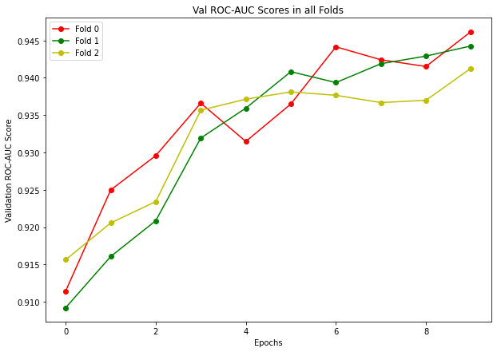

<h1 align='center'>Detecting Aliens using Deep Learning 👽</h1>

<p align="center">

</p>

<p align="center">


</p>

## Introduction

This repository contains the code I wrote for identifying anomalous signals in scans of Breakthrough Listen targets for [SETI Breakthrough Listen - E.T. Signal Search](https://www.kaggle.com/c/seti-breakthrough-listen) Competition hosted on Kaggle.

The main task in this competition is to classify if a Signal is from an "alien source" or not.

I have also made a [full training notebook](https://www.kaggle.com/heyytanay/pytorch-training-augments-vit-kfolds) in this competition.

## Data

Because there are no confirmed examples of alien signals to use to train machine learning algorithms, the team included some simulated signals (that they call “needles”) in the haystack of data from the telescope.
They have identified some of the hidden needles so that we can train out model to find more.

The data consist of two-dimensional arrays.

## Training the Model

If you want to train the model on this data as-is, then you would typically have to perform 2 steps:

### 1. Getting the Data right

First, download the data from [here](https://www.kaggle.com/c/seti-breakthrough-listen/data). 

Now, take the downloaded `.zip` file and extract it into a new folder: `input/`.

Make sure the `input/` folder is at the same directory level as the `train.py` file.


### 2. Installing the dependencies

To run the code in this repository, you need a lot of frameworks installed on your system.

Make sure you have enough space on your disk and Internet quota before you proceed.

```shell
$ pip install -r requirements.txt
```

### 3. Training the Model

If you have done the above steps right, then just running the `train.py` script should not produce any errors.

To run training, open the terminal and change your working directory to the same level as the `train.py` file.

Now, for training do:

```shell
$ python train.py
```

This should start training in a few seconds and you should see a progress bar.

If you are having problems related to anything, please open an Issue and I will be happy to help!

## Training Results and Conclusion

Below you can see the per-fold model performance when trained on `vit_base_patch16_224` for 3 folds and 10 epochs in each fold.



**I hope you find my work useful! If you do, then please Star ⭐ this repository!**